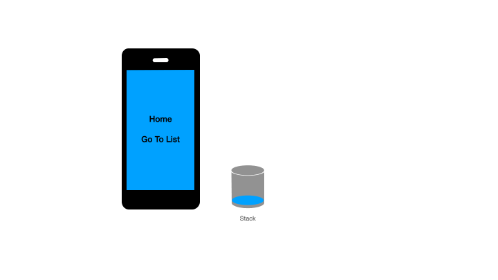

# vue-router-keep-alive-helper
`Vue Router Keep-alive Helper` 是`Vue.js`项目中页面缓存自动管理工具，仅需一行配置代码即可使用。

[Vue 3.x版本](https://github.com/Zippowxk/stack-keep-alive)

[English](./README.md) | 简体中文


### 为什么需要本插件：
在使用```Vue.js```搭配```vue-router```开发单页面应用时，经常使用[keep-alive](https://vuejs.org/v2/api/#keep-alive)组件缓存浏览过的页面来提升用户体验，目前提供了如下配置方式来动态管理缓存
```
include - 只有名称匹配的组件会被缓存。
exclude - 任何名称匹配的组件都不会被缓存。
max - 最多可以缓存多少组件实例。
```
但是这只能处理简单状况，无法应对复杂状况，比如：

1. 如何在返回上一页面时，销毁当前页面缓存
2. 如何缓存多个使用相同组件的页面，并且有针对性的销毁

### 功能

1. 自动侦测前进或后退
2. 后退时自动销毁当前页面缓存
3. 前进时自动创建新的缓存实例，不管该组件是否被缓存过
4. 刷新页面后，仍能够准确识别前进或后退
5. `replaceStay`白名单帮助在tab切换时缓存页面

### 使用方式

1. ```npm i -s vue-router-keep-alive-helper```
2. 将所有页面设置为keep-alive
```html
...
<keep-alive>
  <router-view/>
</keep-alive>
...
```
3. 在vue-router初始化时 添加helper
```javascript
import createHelper from 'vue-router-keep-alive-helper'
import Vue from 'vue'
const router = new VueRouter({routes})
createHelper({Vue, router});
...
```

### 配置

1. replace白名单
  
  在tab栏切换时，需要留存某些tab页面，可以在replaceStay中配置这些路径
```javascript
  createHelper({Vue, router, replaceStay:["/home","/cart","/mine"]});
```

### 更新日志
#### v0.0.21
1. 支持非全局keep-alive路由
2. 增加打包脚本

### TODO:
1. `beforeRouteUpdate` 钩子使用给出用户警告 
2. 支持Vue.js 3 和 router 4 ✅  👉🏻[Vue 3.x版本](https://github.com/Zippowxk/stack-keep-alive)
3. 支持单元测试 ✅ [Vue 3.x版本](https://github.com/Zippowxk/stack-keep-alive)

### Sample code

1. [静态文件引入](./examples/)
2. [工程化代码](https://github.com/Zippowxk/vue-router-helper-demo)

欢迎添加微信 **OmniBug **探讨交流，Email: zippowangxinkai@gmail.com
## Contributors ✨
<!-- ALL-CONTRIBUTORS-LIST:START - Do not remove or modify this section -->
<!-- prettier-ignore-start -->
<!-- markdownlint-disable -->
<table>
  <tr>
    <td align="center"><a href="https://github.com/Zippowxk"><br /><sub><b>wangxinkai</b></sub></a><br /><a href="https://github.com/Zippowxk/vue-router-keep-alive-helper/commits?author=Zippowxk" title="Code">💻</a> <a href="https://github.com/Zippowxk/vue-router-keep-alive-helper/commits?author=Zippowxk" title="Documentation">📖</a></td>
    <td align="center"><a href="https://github.com/kamilic"><br /><sub><b>kamilic</b></sub></a><br /><a href="https://github.com/Zippowxk/vue-router-keep-alive-helper/commits?author=kamilic" title="Code">💻</a> <a href="#ideas-kamilic" title="Ideas, Planning, & Feedback">🤔</a></td>
  </tr>
</table>

<!-- markdownlint-restore -->
<!-- prettier-ignore-end -->

<!-- ALL-CONTRIBUTORS-LIST:END -->